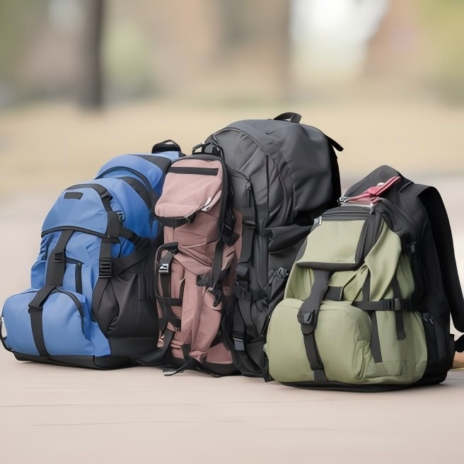
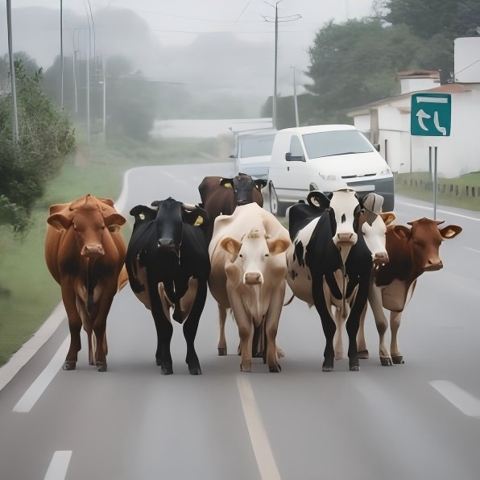
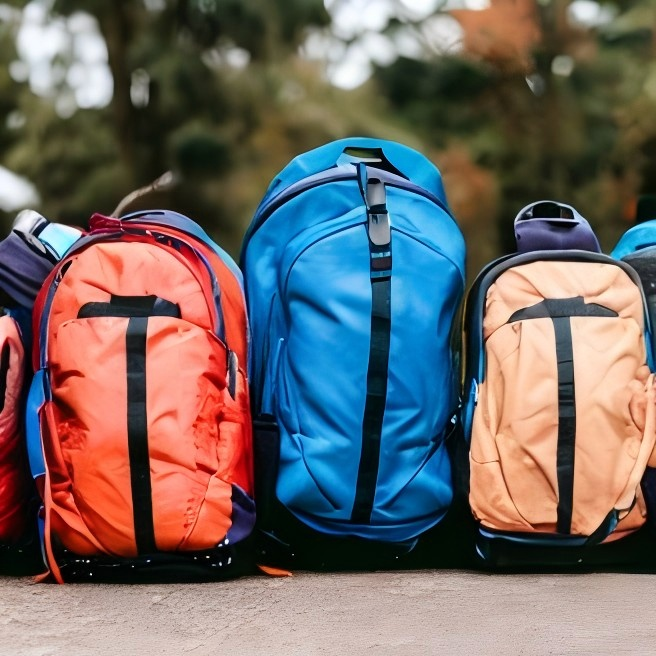
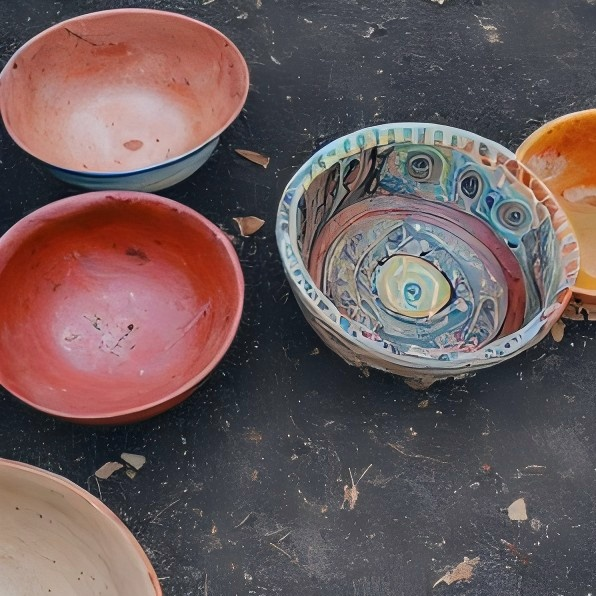
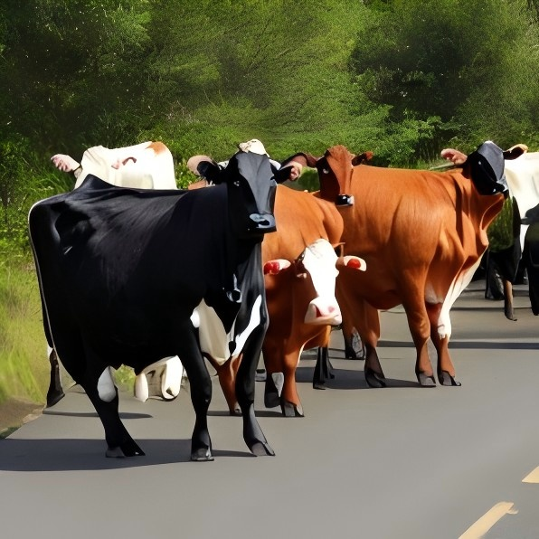
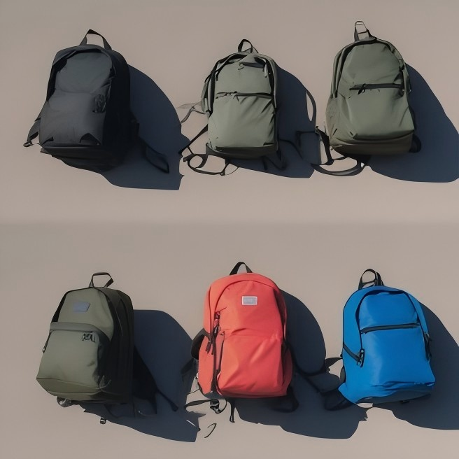
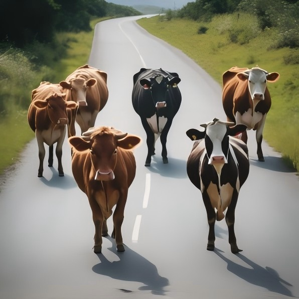
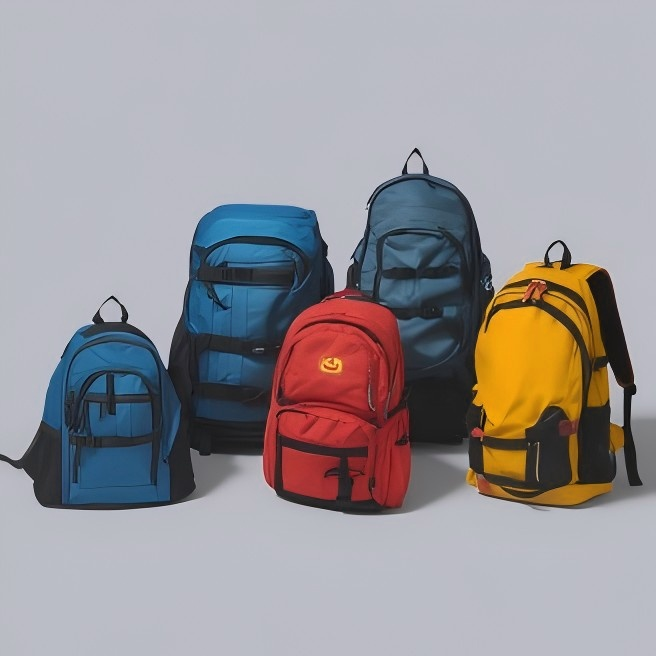
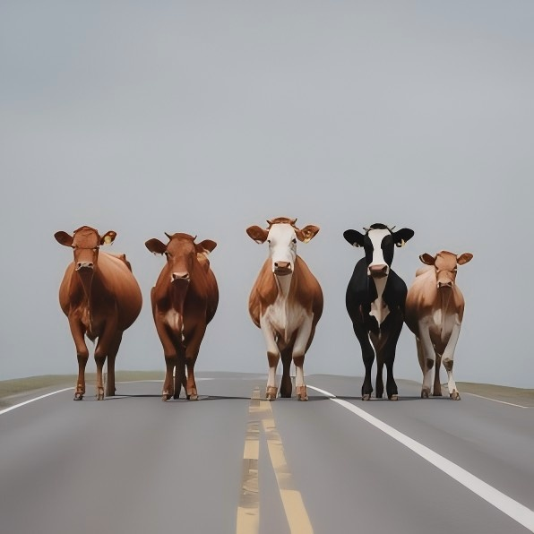

# CountRight

CountRight is an SDXL-based pipeline for generating counting images, paired with YOLOv9 to evaluate the accuracy of object counts in the generated images.

| Method                 |       A picture of five backpacks. <br /> seed=120599        |         A picture of four bowls. <br /> seed=376704          |          A picture of five cows. <br /> seed=36888           |
| :--------------------- | :----------------------------------------------------------: | :----------------------------------------------------------: | :----------------------------------------------------------: |
| **Count Gen**          |  |  |  |
| **Counting Guidance**  |  |  |  |
| **Mitigating Count**   |  |  |  |
| **Count Right (Ours)** |  |  |  |

## Running

```bash
bash run.sh
```

The script will:

1. Run `pipeline/run_countright.py` (reading `dataset/CoCoCount.json`) to generate images into `outputs/`
2. Run `evaluation_script.py` (using YOLOv9 detection) to evaluate the results into `eval_output/`

## Weight Files (Download Required)

Due to GitHub's 100MB per-file limit, the following large weight files are not included in the repository. You need to place them at the corresponding paths before running:

| File                      | Size   | Destination Path                                             |
| ------------------------- | ------ | ------------------------------------------------------------ |
| `spatial_prior_predictor_checkpoint.pth` | 474 MB | `pipeline/mask_extraction/spatial_prior_predictor_weights/spatial_prior_predictor_checkpoint.pth` |
| `yolov9e.pt`              | 113 MB | `dataset/yolov9e.pt`                                         |

## Environment Setup

```bash
pip install -r requirements.txt
pip install -r evaluation_requirements.txt
python -m spacy download en_core_web_sm
```

The SDXL base model `stabilityai/stable-diffusion-xl-base-1.0` will be automatically downloaded from HuggingFace on the first run.